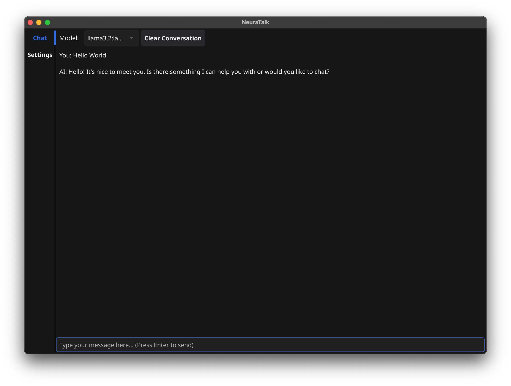

# NeuraTalk

A modern, user-friendly GUI application for interacting with local Ollama language models. NeuraTalk provides a clean interface for chatting with AI models while offering customization options for a personalized experience.



## Features

- 🤖 **Local AI Integration**: Seamlessly connect with your local Ollama language models
- 🎨 **Modern Interface**: Clean and intuitive user interface
- 🌓 **Theme Support**: Switch between light and dark themes
- ⚙️ **Customizable Settings**:
  - Adjustable font sizes
  - Configurable response animation speed
  - Auto-scroll toggle
  - Future model-specific settings
- 💬 **Conversation Management**:
  - Clear conversation history
  - Persistent chat history per model
  - Smooth message animations
- ⌨️ **Keyboard Shortcuts**: Quick and efficient interaction

## Prerequisites

- Go 1.24.0 or later
- CGO enabled
- Ollama installed and running locally

## Installation

1. First, ensure Ollama is running:

   ```bash
   ollama serve
   ```

2. Clone the repository:

   ```bash
   git clone https://github.com/yourusername/NeuraTalk.git
   cd NeuraTalk
   ```

3. Run the application:
   ```bash
   make run
   # or
   go run main.go
   ```

## Usage

1. **Select a Model**:

   - Choose your preferred Ollama model from the dropdown menu at the top
   - Each model maintains its own conversation history

2. **Start Chatting**:

   - Type your message in the input field at the bottom
   - Press Enter to send
   - Watch as the AI responds with a smooth typing animation

3. **Customize Your Experience**:

   - Access settings through the sidebar
   - Adjust theme, font size, and animation speed
   - Toggle auto-scroll behavior

4. **Manage Conversations**:
   - Use the "Clear Conversation" button to start fresh
   - Conversations are automatically saved per model

## Settings

- **Theme**: Switch between light and dark modes
- **Font Size**: Choose between small, medium, and large text
- **Animation Speed**: Adjust the typing animation speed (10-100ms per character)
- **Auto-scroll**: Toggle automatic scrolling to new messages
- **Model Settings**: Configure model-specific parameters (coming soon)

## Development

The project uses:

- [Fyne](https://fyne.io/) for the GUI framework
- [LangChain Go](https://github.com/tmc/langchaingo) for Ollama integration

## Contributing

Contributions are welcome! Please feel free to submit a Pull Request.

## License

This project is licensed under the GNU General Public License v3.0 - see the [LICENSE](LICENSE) file for details.

## Acknowledgments

- [Ollama](https://ollama.ai/) for providing the local AI models
- [Fyne](https://fyne.io/) for the excellent GUI framework
- [LangChain Go](https://github.com/tmc/langchaingo) for the Ollama integration
